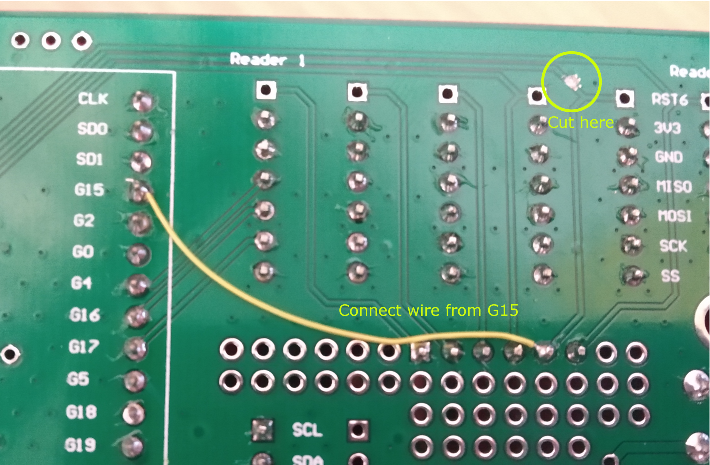
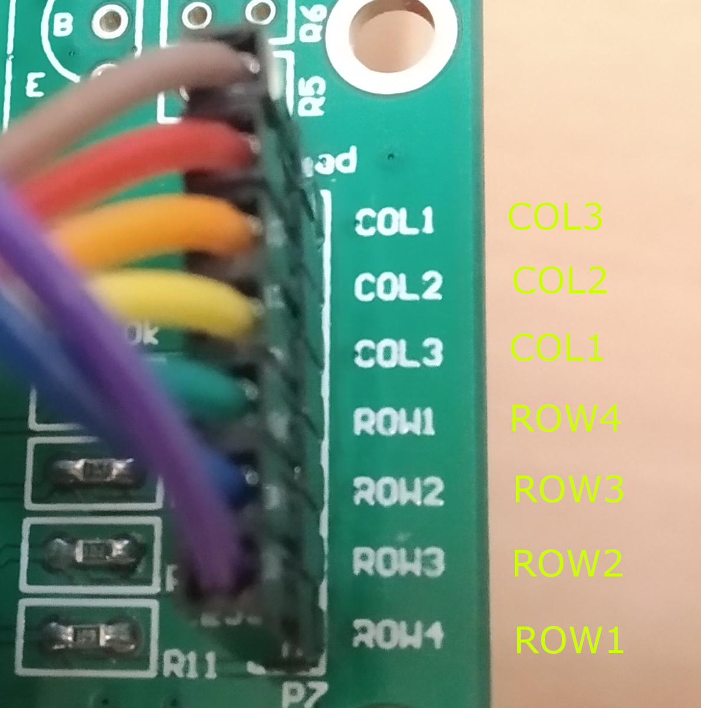

PCB designed to control 6x RC522 RFID readers from a ESP32.

It has been observed that certain RC522 modules sourced from China come populated with a clone/counterfeit MFRC522. These readers appear to operate fine alone (other than a different version ID of `0x12`), but data corruption occurs when multiple RC522 modules are connected on the same SPI bus (my theory is that the negating the SS pins do not fully isolate the readers from the bus).

As such, this project connects all 6 readers together, treating all 6 as a single device (ie sharing `SCK`, `MOSI`, `MISO` and `SS` pins), then asserting all the RST pins of the modules and releasing one at a time for communication.

## Issues with Rev 1:

* G12 of the ESP32 is connected to RST5. This is problematic because the pin is pulled HIGH from the RC522 modules, preventing the ESP32 from booting from flash. Connecting RST5 to G15 is a workaround:
  

* The silk screen for the keypad is inverted, the correct pins have been labelled below:
  
